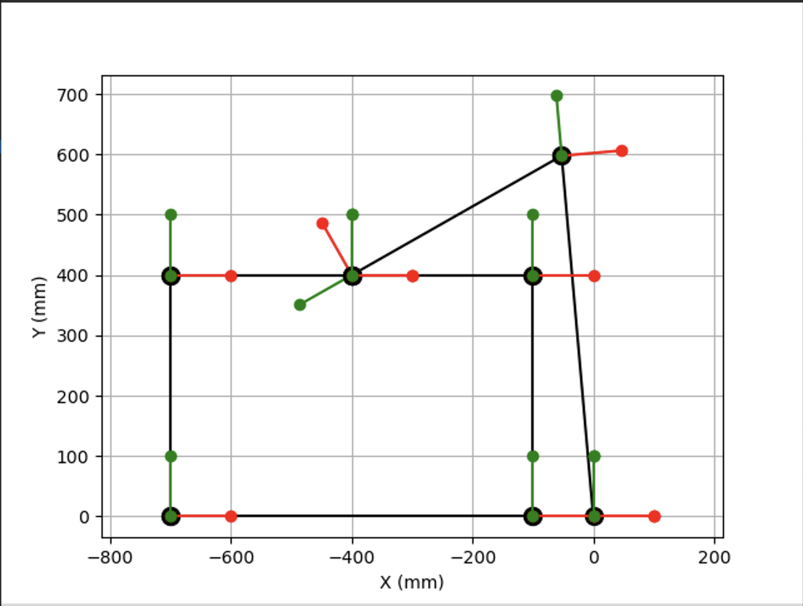

# Robot Arm With KDL

## Task Description  

Given a two link robot with link lengths [600, 400] and a box of dimensions [600, 400]; I had to find a suitable robot configuration, i.e. joint values, to pick up a box that has its long edge aligned with the x-axis and with center C at coordinates (-400, 200). The box needed to be picked at the top, i.e. position P in the drawing below.
>        --------P--------
>       |                 |
>       |        C        |
>       |                 |
>        -----------------   --> x-axis

I also had to draw the kinematic chain of this robot with the box in the specific joint configuration obtained. The result of this task is shown in the image below:     

    

<br/>

## Installation    
Before you can run this program, you need to install the python3-pykdl package (Ubuntu 20.04+ or Debian Buster+):     

```python
    sudo apt-get install python3-pykdl
```

For older Linux distributions with official ROS 1 support, Orocos KDL and its Python bindings may be available from the ROS package repository, for example by running:

```python
    sudo apt-get install -y ros-melodic-python-orocos-kdl
    source /opt/ros/melodic/setup.bash
```
in Ubuntu 18.04 (with Python 2.7!).

<br/>

As an alternative, Orocos KDL can be installed from source:
[https://github.com/orocos/orocos_kinematics_dynamics/blob/master/orocos_kdl/INSTALL.md](https://github.com/orocos/orocos_kinematics_dynamics/blob/master/orocos_kdl/INSTALL.md) 

Reference: [https://docs.orocos.org/kdl/overview.html#](https://docs.orocos.org/kdl/overview.html#)

<br/>

You can run this script by typing

```python
    python3 questions.py
```
from the command line.
